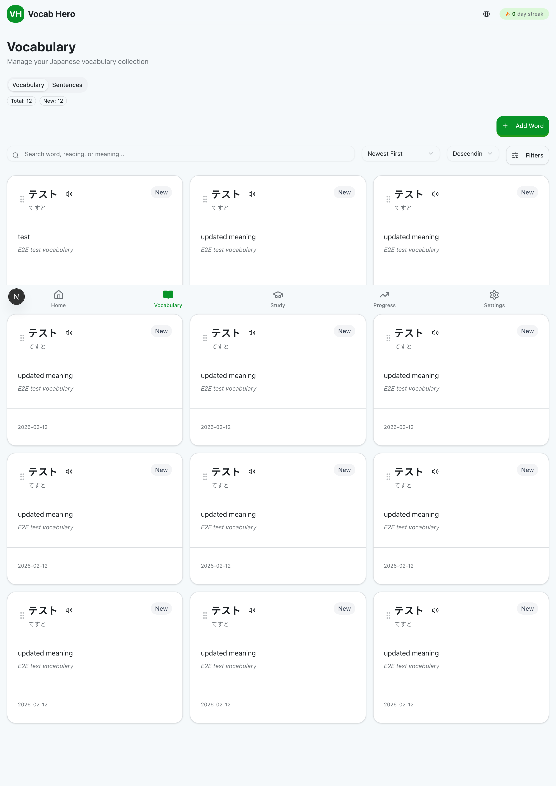
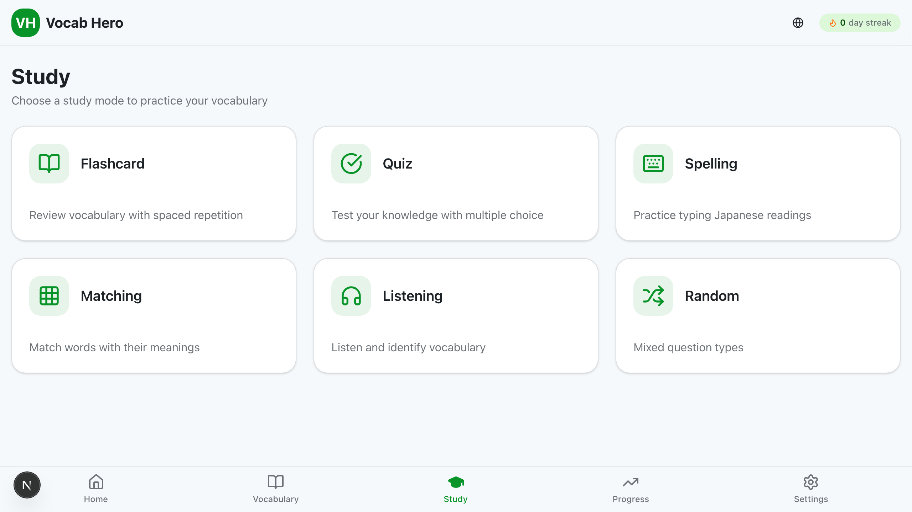
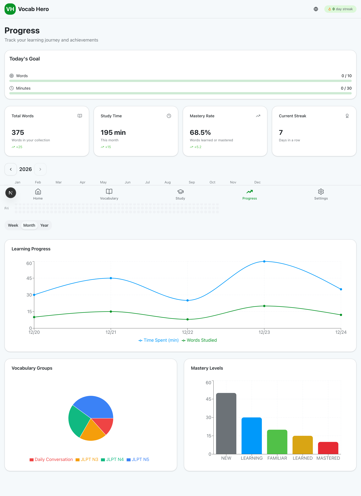

# Vocab Hero

A Japanese vocabulary learning application with spaced repetition, multiple study modes, and progress tracking. Available as a web app and a desktop app.

## Table of Contents

- [Overview](#overview)
- [Features](#features)
- [Getting Started](#getting-started)
  - [Prerequisites](#prerequisites)
  - [Installation](#installation)
  - [Usage](#usage)
- [Configuration](#configuration)
- [Project Structure](#project-structure)
- [Testing](#testing)
- [Contributing](#contributing)
- [License](#license)

## Overview

Vocab Hero helps users learn Japanese vocabulary through evidence-based study techniques. It uses the SM-2 (SuperMemo 2) spaced repetition algorithm to schedule reviews at optimal intervals, and offers six distinct study modes to keep practice varied and effective.

The project is a pnpm monorepo with three packages: a Next.js web application, an Electron desktop application, and a shared library containing the spaced repetition algorithm and common types. It supports English and Traditional Chinese (zh-TW) via next-intl.

## Features

- **Vocabulary management** -- Add, edit, and organize words into groups. Track mastery levels from NEW through LEARNING, FAMILIAR, LEARNED, to MASTERED.

  

- **Six study modes** -- Flashcard, Quiz, Spelling, Matching, Listening, and Random modes provide varied ways to practice and reinforce vocabulary.

  

- **Spaced repetition** -- SM-2 algorithm calculates review intervals based on performance, surfacing words right when they need reinforcement.

- **Progress tracking** -- Contribution wall, accuracy charts, and mastery distribution graphs visualize study history over daily, weekly, monthly, and yearly timeframes.

  

- **Goals and streaks** -- Set daily word and time targets. Streak tracking with freeze support keeps motivation consistent.

- **Duolingo OCR import** -- Import sentences from Duolingo screenshots using Tesseract.js optical character recognition.

- **Sentence cards** -- Store and review sentence-level examples alongside individual vocabulary items.

- **Customizable settings** -- Theme (light/dark/system), TTS voice and speed, cards per session, language preference, and notification controls.

- **Desktop app** -- Electron wrapper for macOS with auto-update support.

## Getting Started

### Prerequisites

- Node.js >= 22
- pnpm >= 10
- PostgreSQL (for the database)

### Installation

```bash
# Clone the repository
git clone https://github.com/chienchuanw/vocab-hero.git
cd vocab-hero

# Install dependencies
pnpm install

# Set up environment variables
cp packages/web/.env.example packages/web/.env
# Edit packages/web/.env and fill in DATABASE_URL and other values

# Initialize the database
pnpm --filter @vocab-hero/web exec prisma migrate dev

# (Optional) Seed development data
pnpm --filter @vocab-hero/web seed:dev
```

### Usage

**Web application:**

```bash
pnpm dev:web
```

Open [http://localhost:3000](http://localhost:3000) in your browser.

**Desktop application:**

```bash
pnpm dev:desktop
```

## Configuration

Environment variables for the web package (see `packages/web/.env.example`):

| Variable | Description | Default |
|----------|-------------|---------|
| `DATABASE_URL` | PostgreSQL connection string | -- |
| `NEXTAUTH_URL` | Base URL for authentication | -- |
| `NEXTAUTH_SECRET` | Secret key for session encryption | -- |

## Project Structure

```text
vocab-hero/
├── packages/
│   ├── web/                # Next.js web application
│   │   ├── src/
│   │   │   ├── app/        # App Router pages and API routes
│   │   │   ├── components/ # React components
│   │   │   ├── hooks/      # Custom React hooks
│   │   │   └── lib/        # Utilities, API helpers, SRS logic
│   │   ├── prisma/         # Database schema and migrations
│   │   ├── messages/       # i18n translation files (en, zh-TW)
│   │   └── e2e/            # Playwright end-to-end tests
│   ├── desktop/            # Electron desktop app
│   └── shared/             # Shared types, enums, SM-2 algorithm
├── .github/workflows/      # CI pipelines (lint, typecheck, test)
├── pnpm-workspace.yaml
└── package.json
```

## Testing

```bash
# Unit and integration tests (Vitest)
pnpm test:web

# End-to-end tests (Playwright)
pnpm --filter @vocab-hero/web test:e2e

# Test coverage
pnpm --filter @vocab-hero/web test:coverage
```

## Contributing

1. Fork the repository
2. Create a feature branch (`git checkout -b feature/your-feature`)
3. Commit your changes
4. Push to the branch and open a Pull Request

Run `pnpm lint:web` and `pnpm test:web` before submitting to ensure code quality.

## License

This project does not currently specify a license.
